# 🩺 Amazon Comprehend Medical
**Amazon Comprehend Medical** is a service designed to extract information from unstructured medical texts using natural language processing model (NLP) while ensuring compliance with HIPAA requirements. 
This service provide the following outputs:
* **Entities**: Key medical elements identified in the text, such as medications, diagnoses, symptoms, and procedures. 
* **RxNorm Codes**: These codes are derived from a medical ontology that provides normalized names for medications and drugs, ensuring consistent identification and categorization of medication-related information.
* **SNOMED CT**: This code set originates from a comprehensive medical ontology that represents clinical concepts such as diseases, procedures, and diagnoses, facilitating precise and interoperable health data.


> At the time of writing this article, only English texts can be processed usign this service.

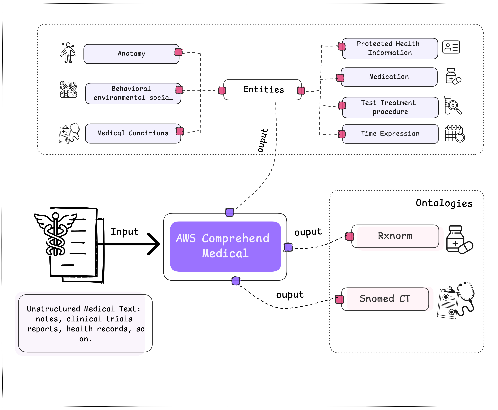


## 🛡️ What is HIPAA?

The **HIPAA (Health Insurance Portability and Accountability Act)** privacy rule sets national standards for the protection of individually identifiable health information in the United States.

Trhis refers to data, including demographic information, that relates to:
* The individual's past, present, or future physical or mental health or condition,
* The provision of healthcare to the individual, or
* The past, present, or future payment for healthcare provided to the individual, and that identifies the individual or can reasonably be used to identify them, where this includes common identifiers such as name, address, date of birth, and Social Security number.

---

### 🩺 AWS Comprehend Medical: Detect Entities

The **detect_entities_v2** method from AWS Comprehend Medical identifies and classifies various categories of medical information within a text. Below is an image illustrating the categories detected by this method. [6]

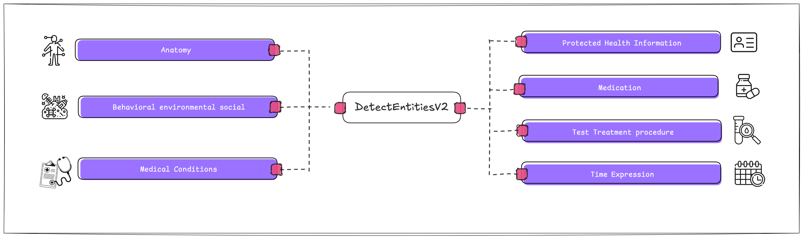


For each of these classes, not only are the categories to which the entity belongs detected, but also other key values. These values include:

* **Type**: The specific type of entity within a category.
* **Attribute**: Relevant information about the entity, such as the dosage of a medication.
* **Trait**: Additional aspects that Amazon Comprehend Medical understands about an entity based on context, such as the NEGATION trait if a medication is not being administered to the patient.

Below, you can see the additional data that can be obtained for each category.

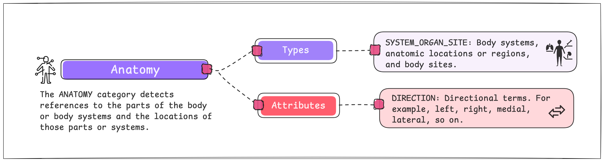
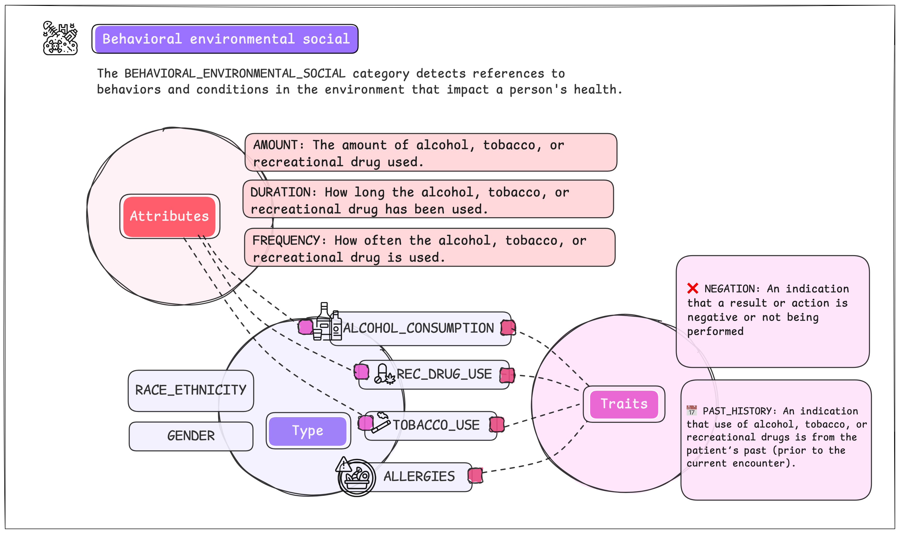
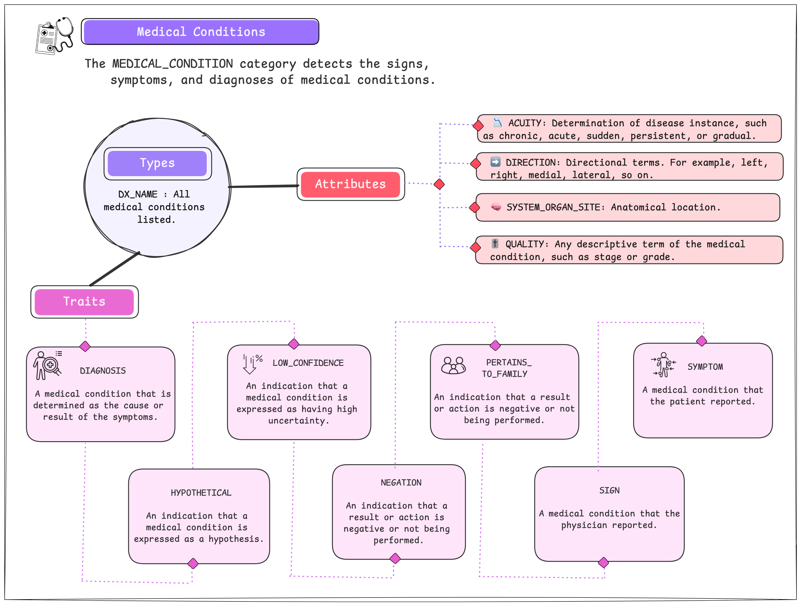

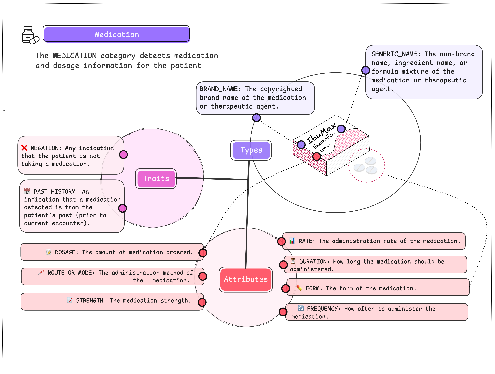
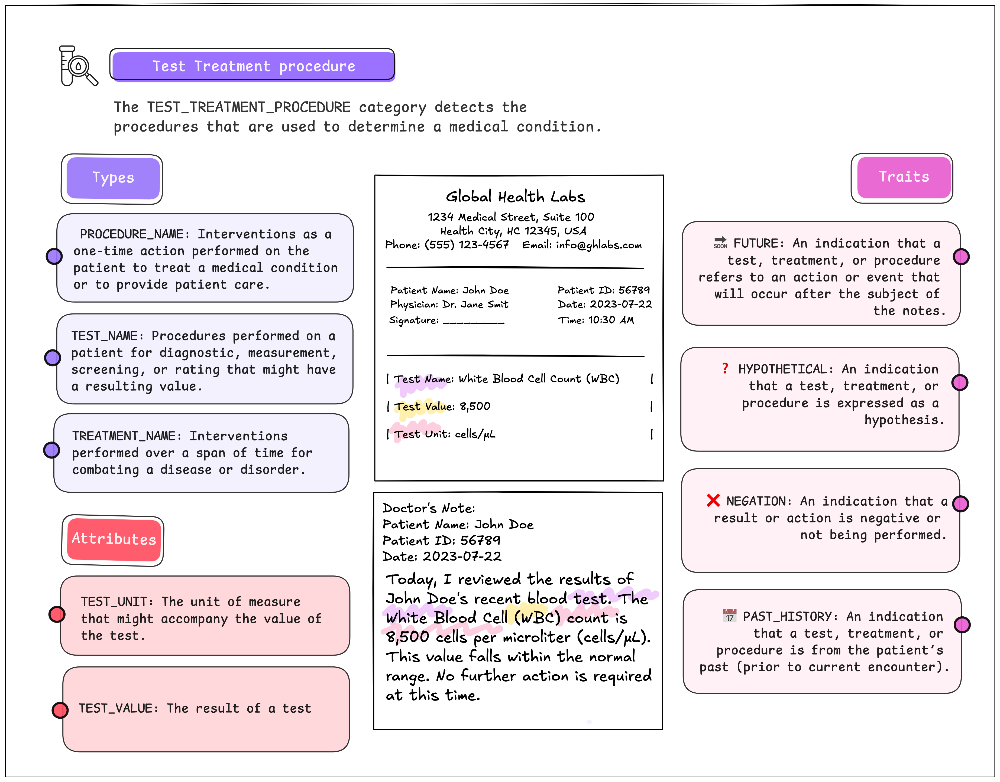
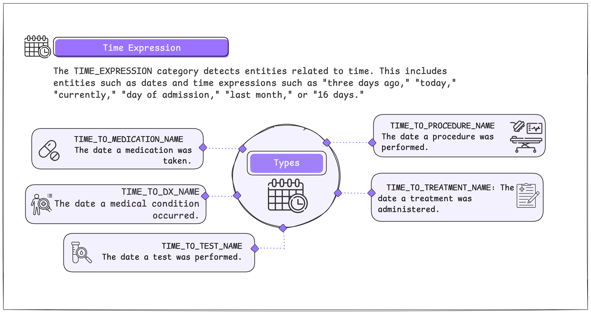

----

### 🩺 AWS Comprehend Medical: RxNorm

RxNorm is a standardized medical ontology that provides normalized names for clinical medications, and also It serves as a comprehensive resource for identifying and categorizing drugs and their various forms. RxNorm links these standardized names to many other drug vocabularies, ensuring consistency and interoperability across different healthcare systems.

Below is an example with a medication and the related concepts in **RxNorm**.

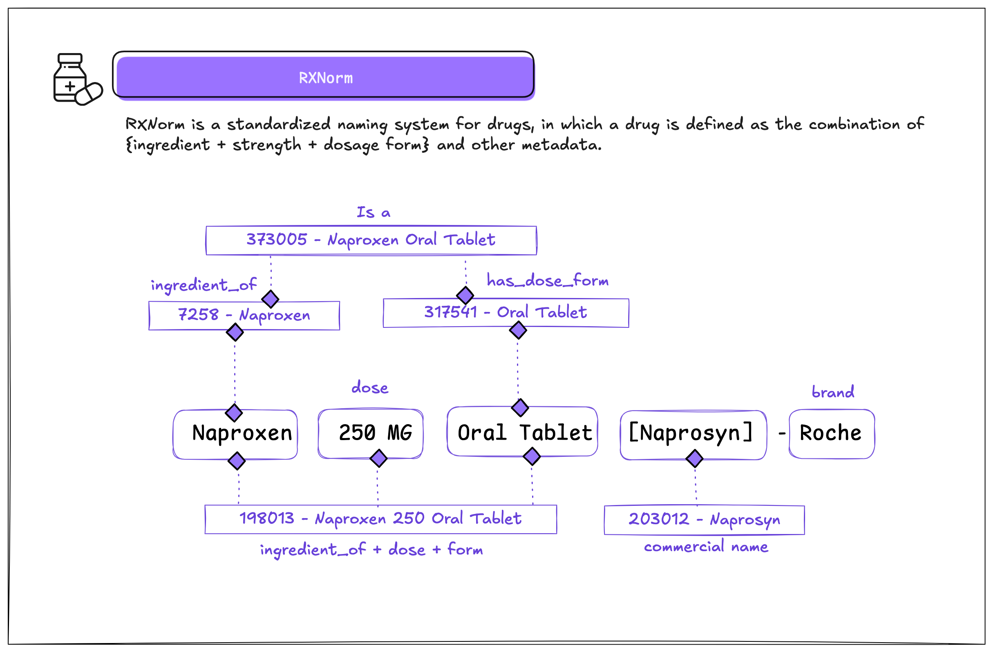

---

### 🩺 AWS Comprehend Medical: SNOMED CT (Clinical Terms)
**SNOMED CT** (Systematized Nomenclature of Medicine -- Clinical Terms) is a comprehensive multilingual health terminology system. It provides a standardized set of codes, concepts, and synonyms to represent clinical information, including diseases, procedures, and diagnoses. 

> SNOMED CT facilitates semantic interoperability by allowing mapping between different health vocabularies, such as `ICD-9` and `ICD-10`.

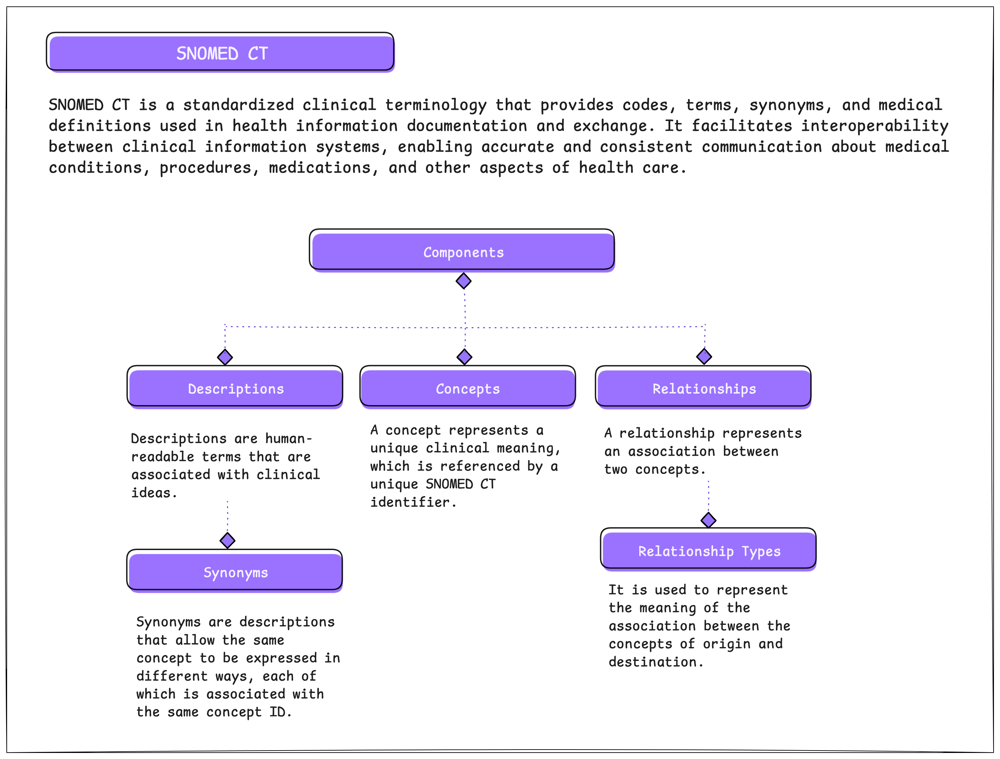
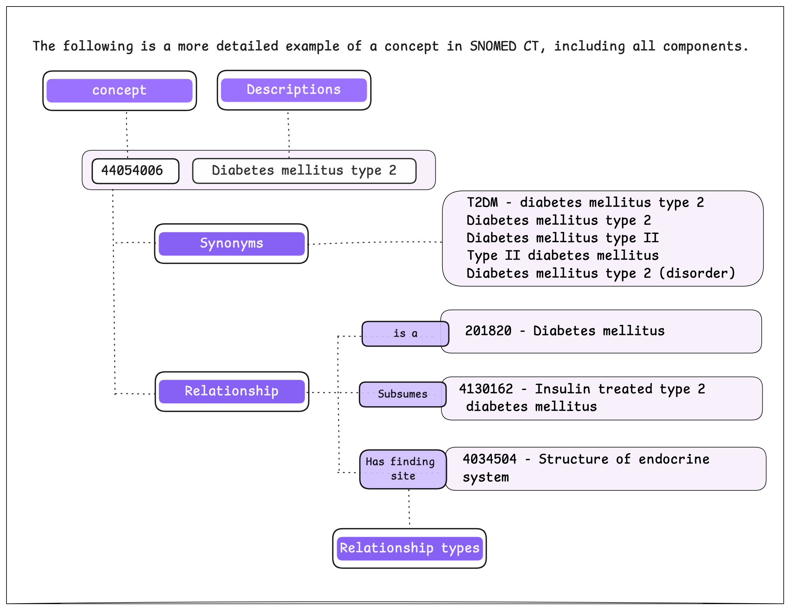

---

## 🩺 Dataset
For this tutorial, we will use a dataset from **Kaggle** that is associated with the USMLE® Step 2 Clinical Skills examination, this licensing exam evaluates the examinee's ability to recognize pertinent clinical facts during interactions with standardized patients.

We will use select medical notes from this dataset to process and analyze the results obtained using the AWS Comprehend Medical service.

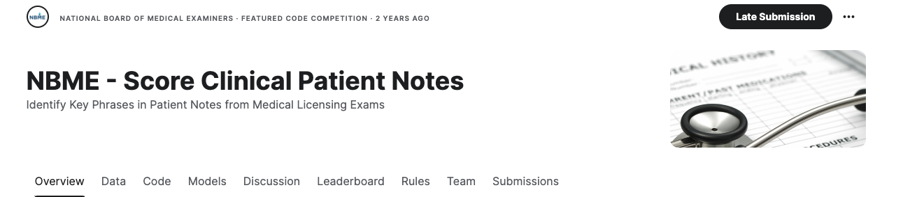

source: [NBME - Score Clinical Patient Notes](https://www.kaggle.com/c/nbme-score-clinical-patient-notes/data?select=patient_notes.csv)

---

### 🔧 Prerequisites

To complete this tutorial, you need to meet the following prerequisites:


* **AWS Credentials**: You must configure the `AWS_ACCESS_KEY` and `AWS_SECRET_KEY` credentials. These are crucial for authenticating and authorizing access to AWS services.
* **S3 Bucket**: Create an S3 bucket to store your data. In this example, we will use a bucket named `dev-medical-notes` located in the `us-east-1` region.
* **Permissions**: Check the IAM folder in this repository for the necessary policies and permissions to apply.

> ⚠️ If you're not familiar with creating AWS credentials or setting up an S3 bucket, you can follow this guide: [Create a Bucket](https://docs.aws.amazon.com/AmazonS3/latest/userguide/creating-bucket.html).

---

**🔐 AWS Credentials**<br>

For this tutorial, AWS credentials (`AWS_ACCESS_KEY` and `AWS_SECRET_KEY`) are required, these credentials are essential for authenticating and authorizing access to AWS services and they can be generated using the **IAM** (Identity and Access Management) service.

> ⚠️ Remember to keep your credentials secure and avoid sharing them to prevent unauthorized access to your AWS account.

---

**🔐 IAM Policies and Role**<br>

For this tutorial, you need a role and a user with specific policies applied. In the GitHub repository, you'll find a folder containing the policies that need to be applied.

---

**📦 AWS Libraries**<br>

The main libraries we will use are:

* **boto3**: This library allows us to connect programmatically to Amazon Web Services (AWS) services.
* **awswrangler**: This open-source Python library integrates pandas with AWS, enabling seamless data manipulation and analysis within AWS services.

----

**🔧 Configuration Setup**<br>

To manage AWS credentials, we will use the python-dotenv library to handle environment variables.
You need to create a file named .env in the root of the project and configure your AWS credentials there. Below, you will find the format for the file.

> File Name: `.env`
```yaml
AWS_SECRET_KEY='mySecretKey'
AWS_ACCESS_KEY='myAccessKey'
AWS_ROLE='arn:aws:iam::xxxx:role/role-name'
```

---

**⚠️ Considerations**<br>

To make this tutorial more cohesive and reduce the complexity of implementing a solution, two classes were created, which are as follows:

`📦 S3bucket Class`<br>

To simplify the explanation of this tutorial and the results obtained from the **AWS Comprehend Medical** service, I have created a class named `S3bucket`. This class will enable us to perform various common operations with the files stored in an S3 bucket. These operations include listing the files in a bucket, writing a JSON file, writing a Parquet file, and reading a JSON file. 

`📦 ComprehendMedical Class`<br>

To simplify the use of AWS Comprehend Medical and facilitate the creation of DataFrames, a class named `ComprehendMedical` has been developed. This class is designed to streamline interactions with the service's methods, including **detect_entities_v2**, **infer_rx_norm**, and **infer_snomed_ct**. Below are the primary methods of this class and their functionalities:

- **get_entities**: This method uses the detect_entities_v2 function from AWS Comprehend Medical to identify medical entities in a given text.
- **get_rxnorm**: This method employs the infer_rx_norm function to extract medication-related information from the text.
- **get_snomed**: This method uses the infer_snomedct function to identify and obtain information related to standardized medical terms in the SNOMED CT system.

<br>

> **⚒️ Methods to Generate DataFrames**
> Each of the above methods also has a version that returns the results in DataFrame format using pandas. These DataFrames are then saved in Parquet format, which is efficient for storage and querying, and facilitates integration with other data processing tools. The Parquet files are stored in a new 📁 folder named "stage" within the same Amazon S3 bucket.

<br>

---

<br>
<br>

[](https://www.buymeacoffee.com/r0mymendez)